# Piggy

A WORK IN PROGRESS family finance management app.

## Technology Stack

### Web

- ASP.NET Core
- Angular
- MSSQL

### Mobile

- Flutter

## Development Status

Checkout the repository projects tab to see what is planned and what is going on now.
High level planned items can be viewed under organization's projects.

## Mobile App Screenshots

  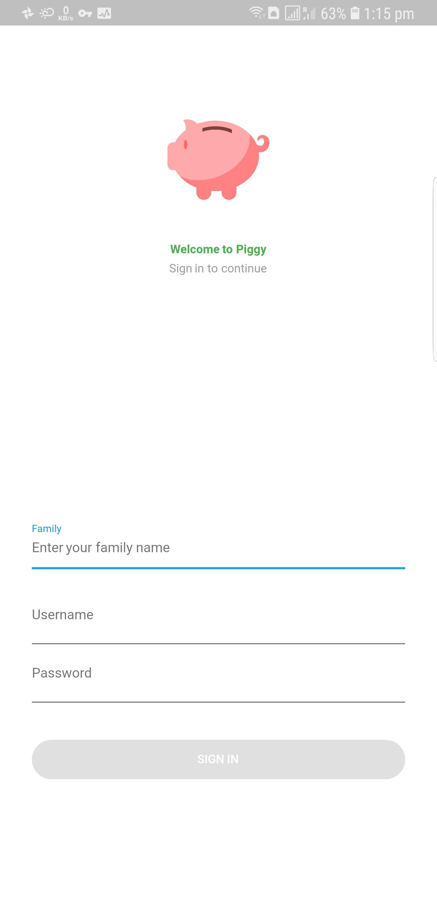
  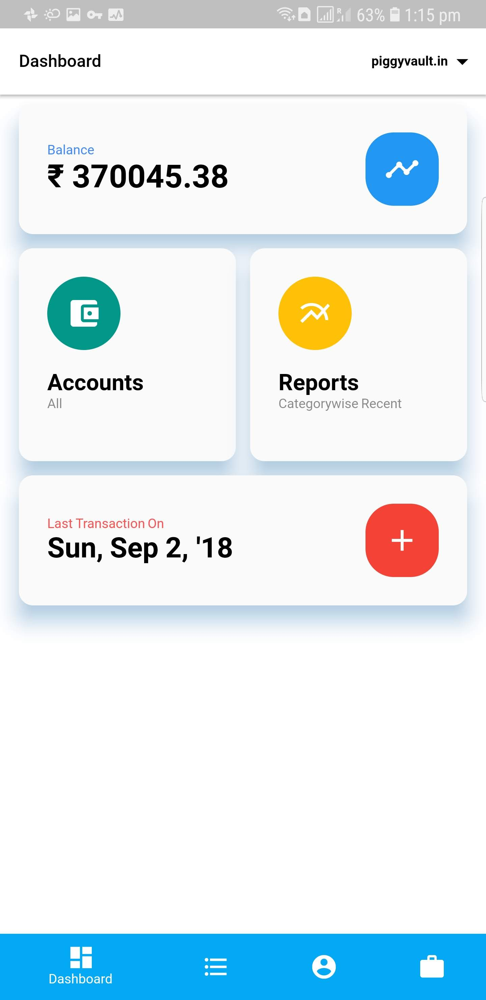 
  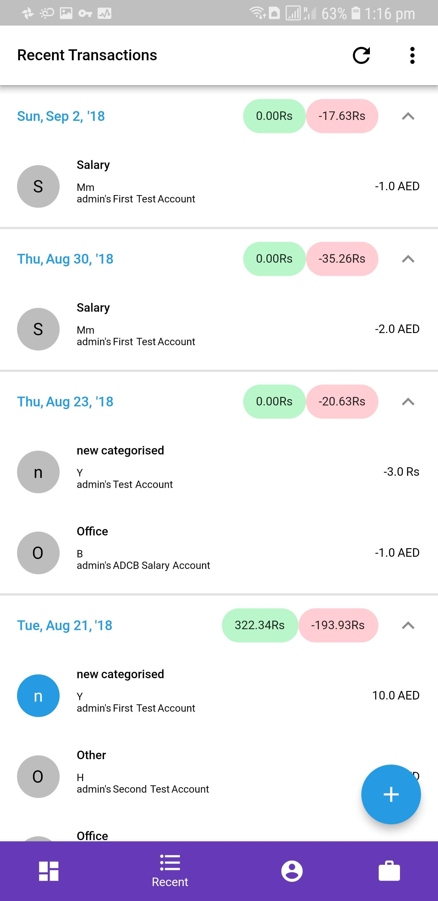
  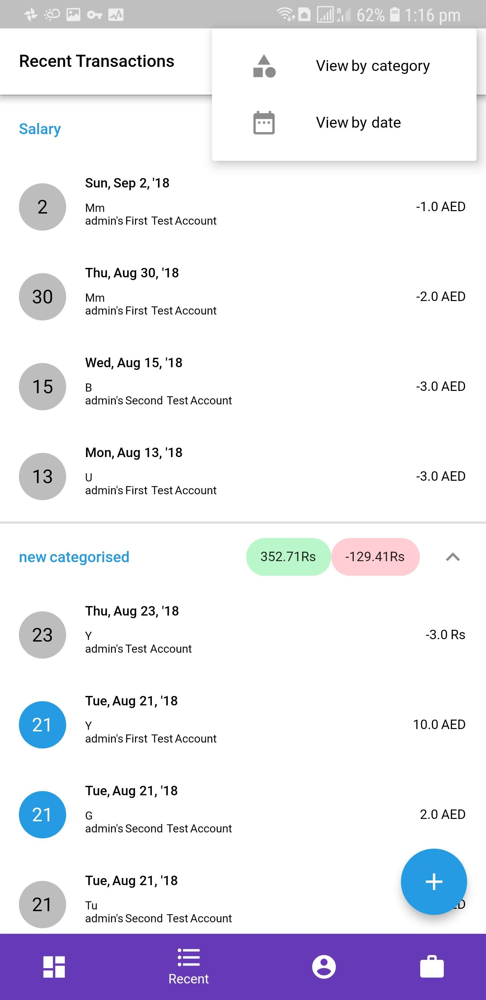
  
  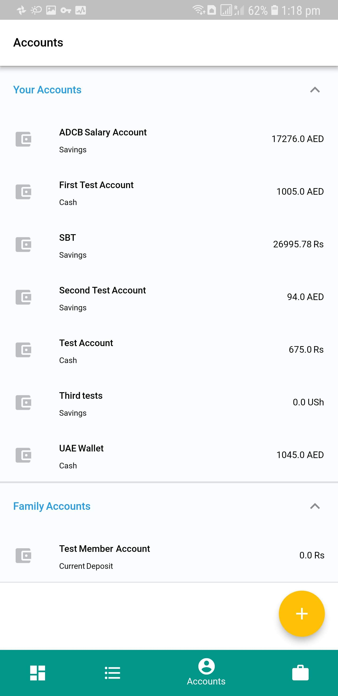
  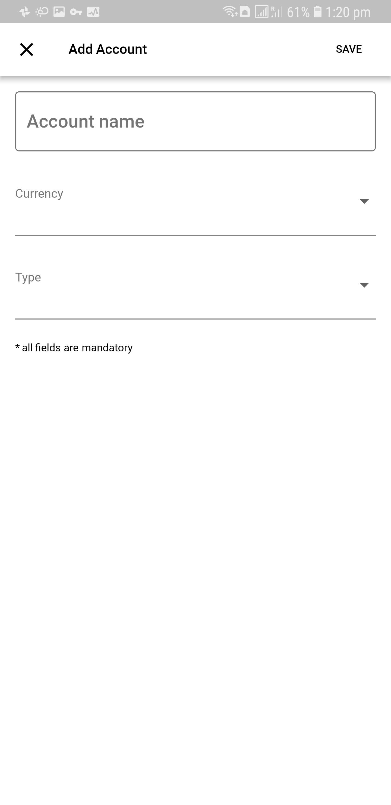
  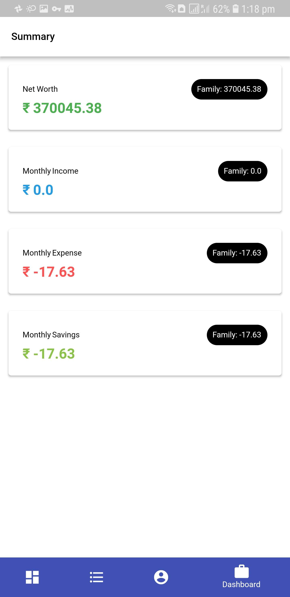
  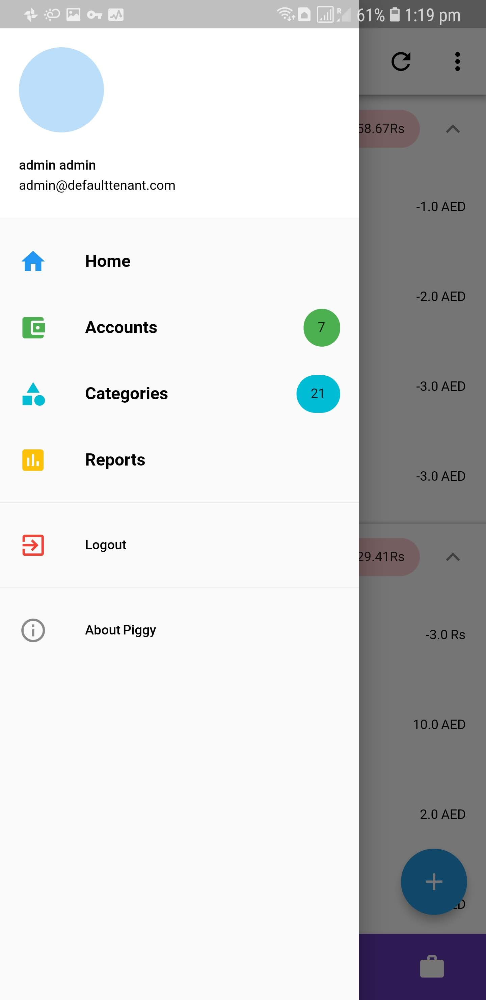
  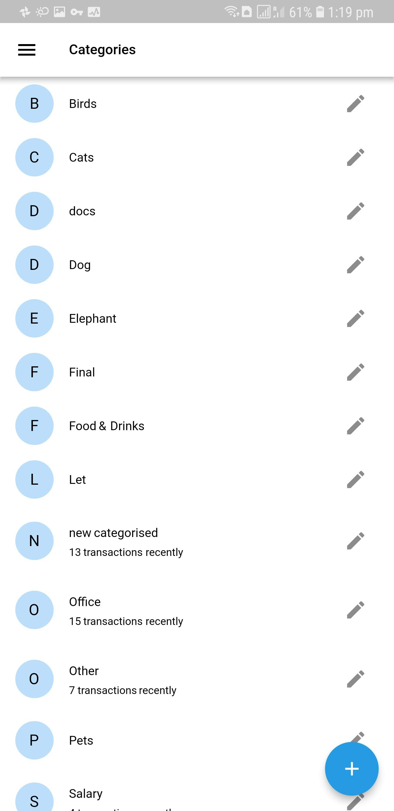
  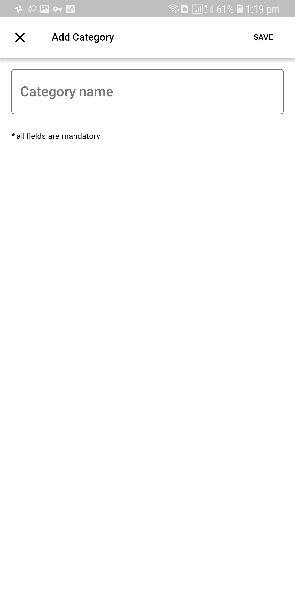
  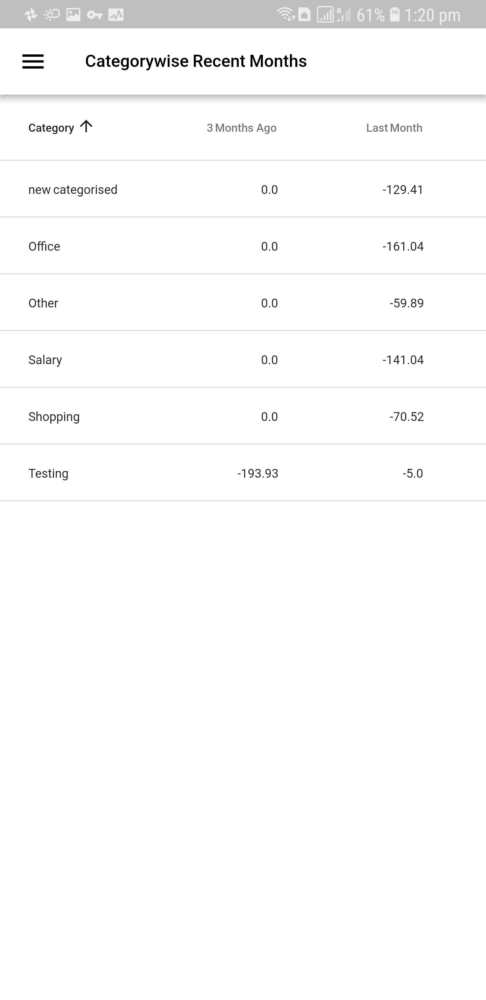
  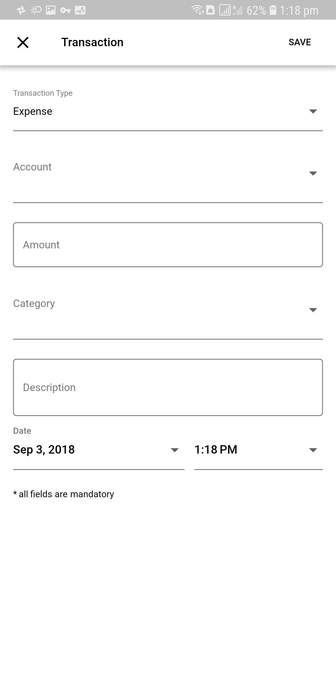
  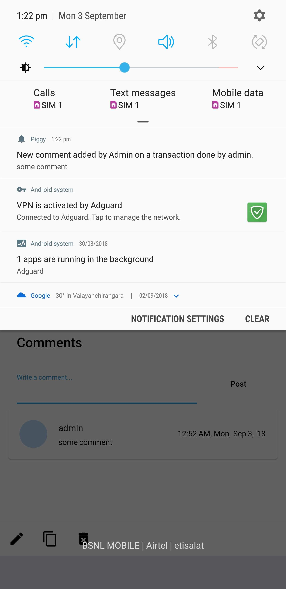
  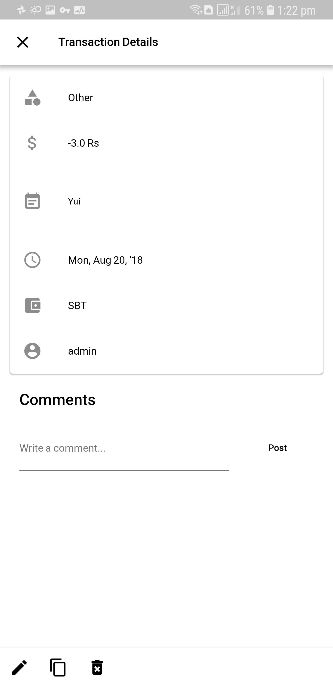
  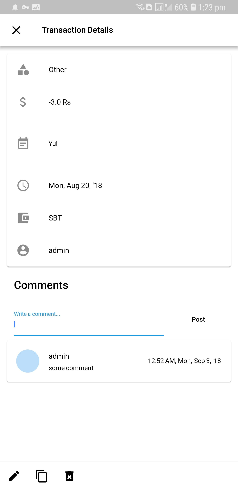
  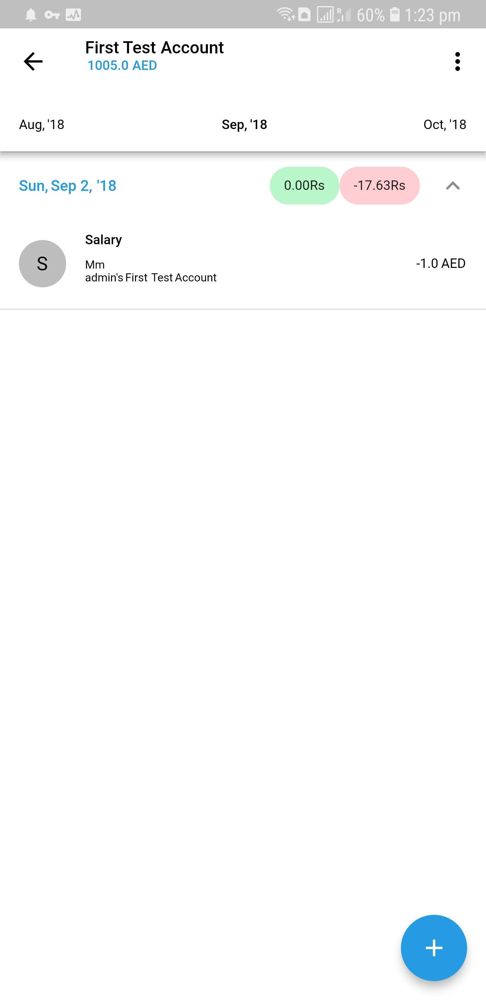
  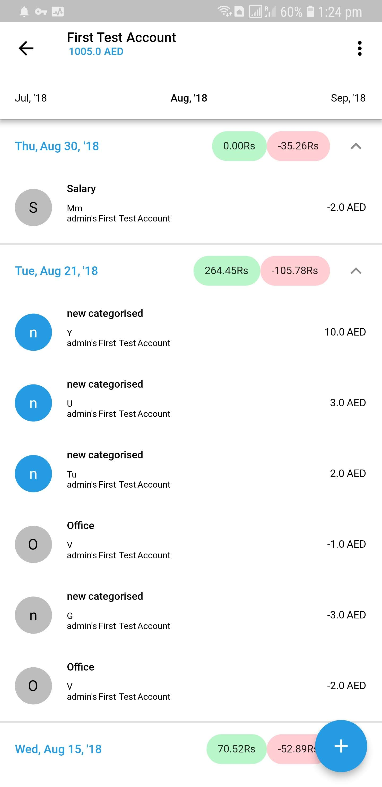
  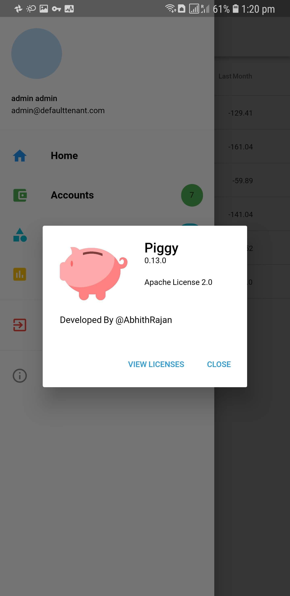

