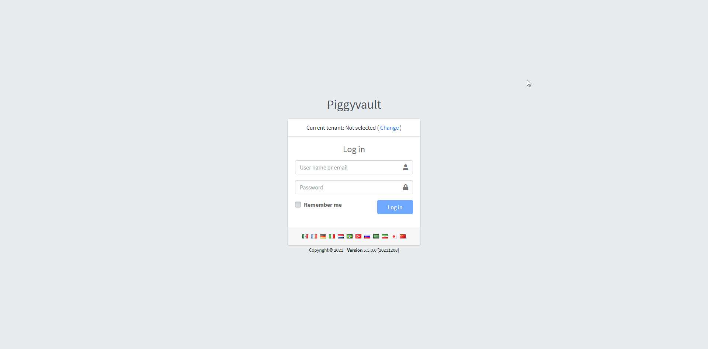
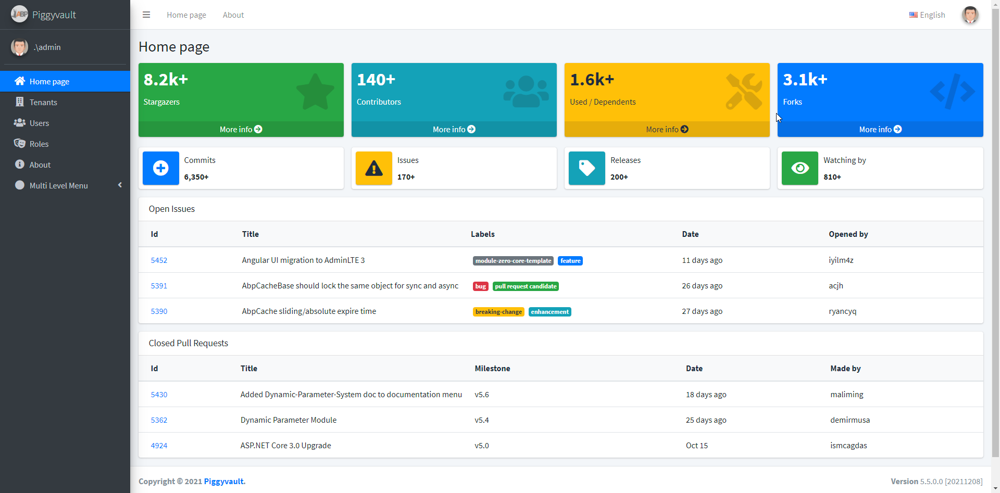
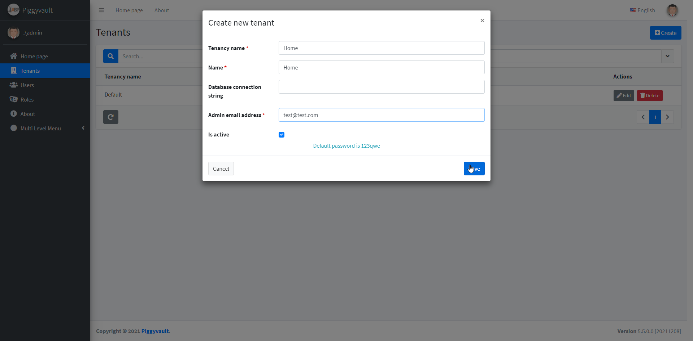
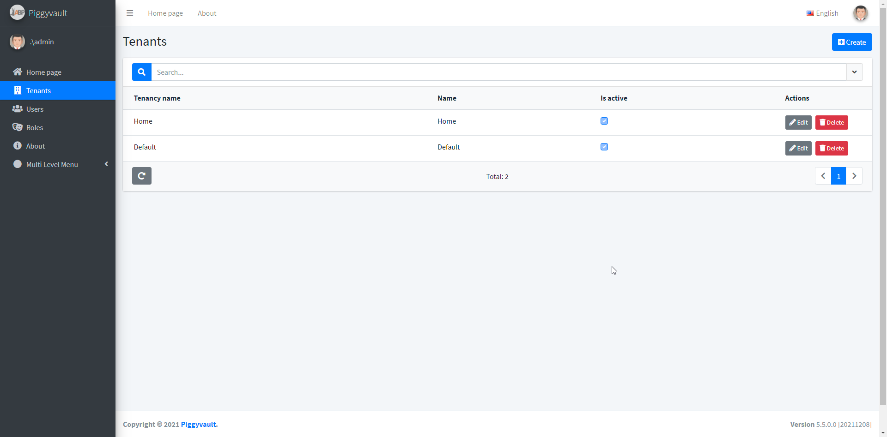
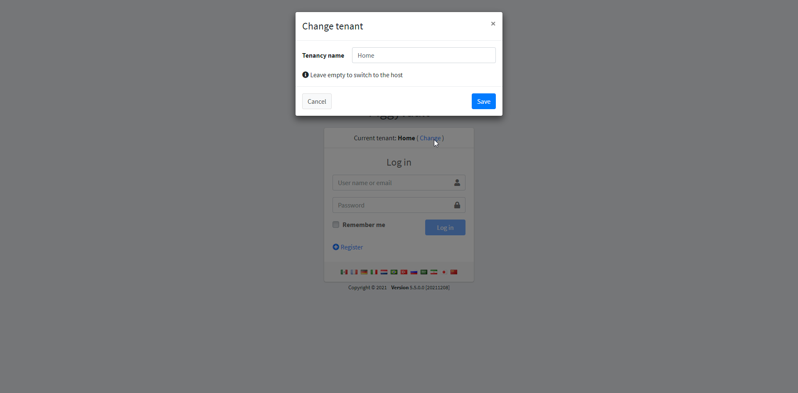
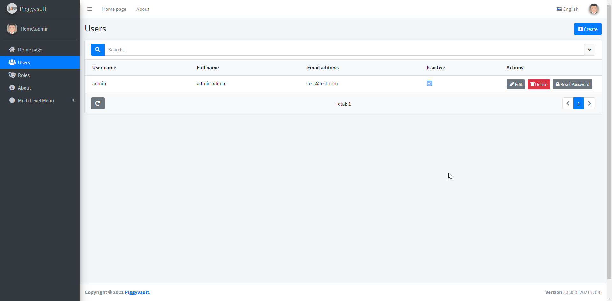
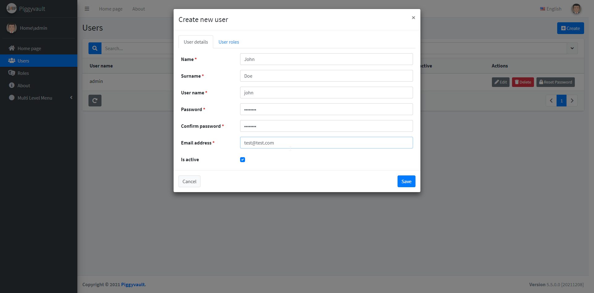
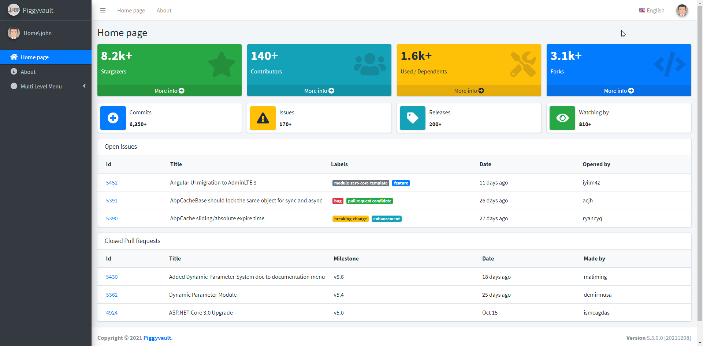

# PORTAL

## Host

Host account is used to manage all tenants.

### Host login

To login to the host account, keep the tenant selection as blank (Not selected).

Enter the default credentials

| Username | Password |
| -------- | -------- |
| admin    | 123qwe   |

Once logged-in, you will land on the aspnetboilerplate's host dashboard.

From the tenant's page, you can create a new tenant,

### Tenant list

## Tenant

### Tenant Login

Once the desired tenant is created, you can login to the tenant admin page to manage tenant users.

To login to the tenant, select the tenant by entering the tenant name in the login tenant selection page and enter the tenant admin credentials.

Once logged-in, Tenant admin can manage tenant users,

And tenant admin's can create new users,

After all, you can verify the newly created user credentials by logging-in again with the user credentials,

## Note

- All the dashboard data displayed on the web portal is dummy and part of the aspnetboilerplate template.
- Web portal is required only to manage or setup tenants and users.
